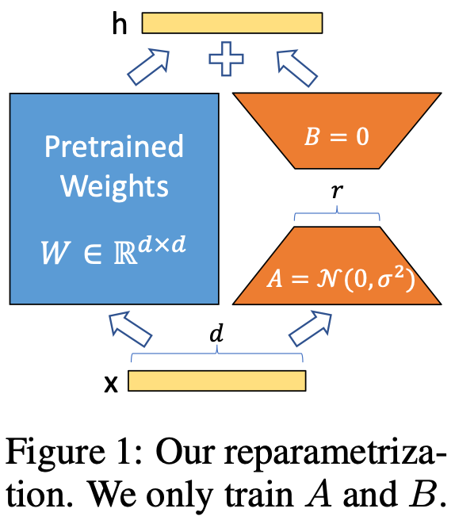
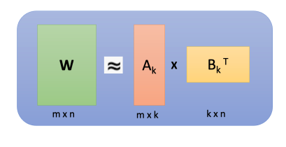
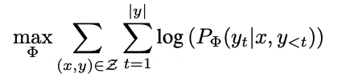
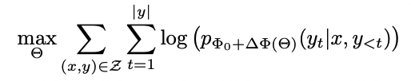
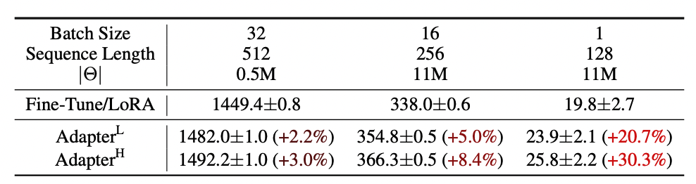

# [엔지니어의 논문 리뷰] LoRA: Low-Rank Adaptation of Large Language Models 논문 리뷰
    * 논문 주소: https://arxiv.org/abs/2106.09685
## 요약
* LoRA는 Transformer 아키텍처에서 사전 훈련된 모델의 가중치를 고정하고 각 계층에 저랭크 분해 행렬(Low-Rank)을 삽입해 훈련 가능한 매개변수의 수를 줄여 매개변수의 효율성을 개선
    * 전체 학습되야할 파라미터 수를 10,000 배 줄이고 GPU 메모리를 3배 줄일 수 있음
    * RoBERTa, DeBERTa, GPT-2, GPT-3 등의 모델의 fine-tuning 방법과 비교해도 비슷하거나 더 나은 성능을 보여줌

## 리뷰
* LLM (Large Language model) 의 경우 fine-tuning 시 모델 파라미터가 너무 크고 리소스가 많이 들어 제약이 있음
* LoRA 는 기존 파라미터 보다 훨씬 적은 파라미터로 튜닝 하여 리소스 제약 감소, 성능도 비슷하거나 더 높음
* 학습된 너무 많은 매개변수화된 모델들이 사실은 낮은 실질 차원에 존재함
    * 생각: 사실 특정 질문에 대해서 LLM 모델에 존재하는 이렇게 많은 파라미터를 이용하는것은 불필요할것  
* 사전 훈련된 모델의 가중치를 고정 / 삽입된 훨씬 작은 낮은 순위 행렬만 최적화
    * 기존 가중치 행렬에 평행하여 훈련 가능한 순위 분해 행렬 쌍을 추가
    * 
    * 저순위 분해 W0 + ∆W = W0 + BA를 사용하여 그 업데이트를 제한 ( W0 고정)
    *  A에 대해서는 무작위 가우스 초기화(random Gaussian init)를,   
    B에 대해서는 0 (zero-init)을 사용하여, ∆W = BA가 훈련 시작 시 0에서 시작됨 => 그런 다음 ∆W x를 α r로 조정
    * 다양한 순위 r에서 WikiSQL과 MultiNLI 결과 1의 작은 순위만으로도 충분 
* 전체 순위(d)가 12,288일 때조차 매우 낮은 순위(r, 1 또는 2로 나타남)만으로도 충분
    * 
* Adam을 사용하여 파인 튜닝된 GPT-3 175B와 비교할 때, LoRA는 학습 가능한 매개변수의 수를 10,000배, GPU 메모리 요구 사항을 3배 줄일 수 있음
* 일반 fine-tuning vs LoRA fine-tuning
    * 일반 fine-tuning
        * 
    * LoRA fine-tuning 사용시 (기존 모델은 두고 주입 행렬만 업데이트)
        * 
* 기존 어댑터 레이어는 추론 지연을 초래 / LoRA를 이용하면 추론 지연(inference latency) 성능 하락이 없음
    * 
* 장비와 시간을 추가 확보하기 어려운 상황에서 도움이 되는 전략

## 관련 코드
    * https://github.com/wotres/deep-learning-study/blob/main/KeT5_Translation_with_PEFT.ipynb 