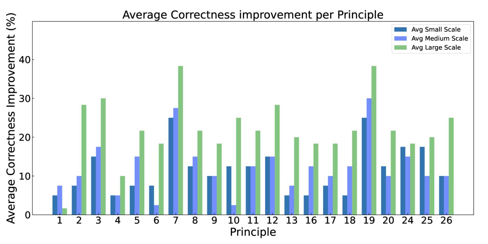

# [엔지니어의 논문 리뷰] Principled Instructions Are All You Need forQuestioning LLaMA-1/2, GPT-3.5/4 논문 리뷰
    * 논문 주소: https://arxiv.org/abs/2312.16171
## 요약
* 대규모 언어 모델에 더 나은 프롬프트를 선별하여 사전 훈련된 LLM의 응답 품질을 더욱 향상하기 위한 26가지 지침 원칙을 소개
1. 간결하고 직접적으로 요청하기
    * 불필요한 어구 없이 예의를 차릴 필요없이 목표를 명확하게 전달 (부디, 감사합니다 이런 표현 지양)
    * 한국의 인기 관광지를 나열해주세요
2. 대상자 명시
    * 답변을 듣고 싶은 대상자의 수준 포함
    * 10살 어린이를 위한 설명을 해주세요
3. 큰 문제를 작은 부분으로 나누어 접근
    * 소설 쓰기 첫 단계는 무엇인가요?
4. 긍정적 지시사항 사용
    * 검색해 주세요(하지마세요 대신 하세요)
5. 명확하고 이해하기 쉽게 요청
    * [특정 주제]를 초보자에게 간단히 설명해주세요
6. 보상제시
    * 더 좋은 답변을 주면 $100 팁을 드릴께요
7. 예제 포함 (few shot)
    * OO 이 있습니다. 이를 참고하여 설명해주세요
8. 포맷 사용 (+ 구분하기 위해 하나 이상의 줄 바꿈을 사용)
    * ###Instruciton###\n다음 질문에 답하세요\n###Question###
9. 구체적인 작업과 필수 조건 명시 (당신의 작업은 / 반드시)
    * 당신의 작업은 ~ 이며, 반드시 긍정적인지 부정적인지 명시하세요
10. 벌칙 포함
    * 정확한 정보만 제공하세요. 그렇지 않으면 잘못된 정보로 인식될 것 입니다.
11. 자연스러운 대화형 요구
    * 다음 질문에 자연스럽고 사람처럼 답변해주세요
12. 단계별 사고 유도
    * OO 을 더하는 방법을 단계별로 설명해주세요
13. 편견없는 답변 유도
    * OO 에 대해 공정하고 편견없는 정보를 제공해주세요
14. 질문을 통해 정확한 세부 사항과 요구 사항을 요청하도록 허용해서 모델에게 충분한 정보를 획득하게 함
    * 추가정보가 필요하면 저에게 질문해주세요.
15. 특정 주제에 이해를 테스트 할때 규칙을 가르쳐 주고 마지막에 테스트를 포함한뒤, 답변을 요구
    * 다음은 OO 테스트입니다. 설명을 읽고 문제에 답하세요 ### 설명 OO ###문제: OO 위 설명과 문제를 보고 답해주세요 
16. 언어모델에 역할을 할당
    * 당신은 python 전문가입니다.
17. 구분자 사용(###)
    * ###Instruction###다음에 질문에 답하세요###Question###
18. 중요한 단어나 구문 반복
    * OO 은 ~. OO 에 대한 내용을 설명해주세요
19. Chain of Thought 와 예시 결합
    * 3단계로 OO 문제를 해결하세요. 먼저 OO ~
20. 원하는 응답의 시작부분을 프롬프트에 포함
    * 다음 문장을 완성하세요. 대한민국의 수도는 ~
21. 상세 정보 포함
    * 코로나에 대해 설명해주세요. 원인과 증상, 그리고 대책을 포함하세요
22. 스타일 유지 요구
    * 원래의 작성스타일을 유지해주세요
23. 복잡한 코딩 프롬프트(ex. 여러파일에 생성되는 코드 생성시) 해당 파일들을 생성하거나 기존 파일에 코드를 삽입할 수 있는 스크립트도 함께 생성하도록 요구
    *  Python 스크립트를 생성할 때, 다음 기능을 수행하는 코드를 여러 파일에 걸쳐 생성하세요: 첫 번째 파일에서는 사용자 입력을 받고, 두 번째 파일에서는 입력된 데이터를 처리하며, 세 번째 파일에서는 처리된 데이터를 기반으로 결과를 출력합니다. 또한, 이러한 작업을 자동으로 연결하는 Python 스크립트를 생성하여, 지정된 파일을 자동으로 생성하거나 기존 파일에 코드를 삽입하세요.
24. 텍스트를 이어 쓰게 요구
    * 아래 가사를 이어서 말해주세요. 강남 스타일 ~
25. 키워드, 규칙, 힌트 제공하여 내용 생성 지시
    * 다음 키워드를 사용하여 생성해주세요. 키워드: 사랑, 평화
    * 당신은 다음 조건에 맞게 답변을 제공할것 입니다. 1) 명확함 2) 간결함 3) 정확성 4) 최신성
26. 제공된 샘플 스타일 요청
    * 위 OO 스타일을 참조하여 비슷한 스타일로 작성해주세요

* 5개의 카테고리 분류
1. 프롬프트 구조와 명확성 (원칙: 2,4,12,20,27,8)
2. 특정성과 정보 (원칙: 7,5,13,26,24,25,15,21)
3. 사용자 상호작용과 참여 (원칙: 14,21)
4. 내용과 언어 스타일 (원칙: 22,9,10,16,11,1,18,6)
5. 복잡한 작업과 코딩 프롬프트 (원칙: 3,23,19)

## 리뷰
* 위 요약 외 기술된 내용
* 원칙에 따라 질문한 내용과 답변 차이
    * 
* 제공된 작업이나 지침이 더 정확할수록 모델이 더 효과적으로 수행되어 모델의 응답이 우리의 기대와 더 밀접하게 일치
    * LLM에 특정 역할을 할당하는 것이 유익한 것으로 입증
    * ex) 청중은 OO 분야의 전문가입니다
* ATLAS 벤치마크를 사용할 때 원칙을 지킨 질문은 GPT-4에 적용될 때 LLM 응답의 품질과 정확성을 각각 평균 57.7%와 36.4% 향상
* 평균적으로 답변이 principle 에 따를시에 향상됨
    * 

## 관련 코드
* 위 요약의 예시로 대체