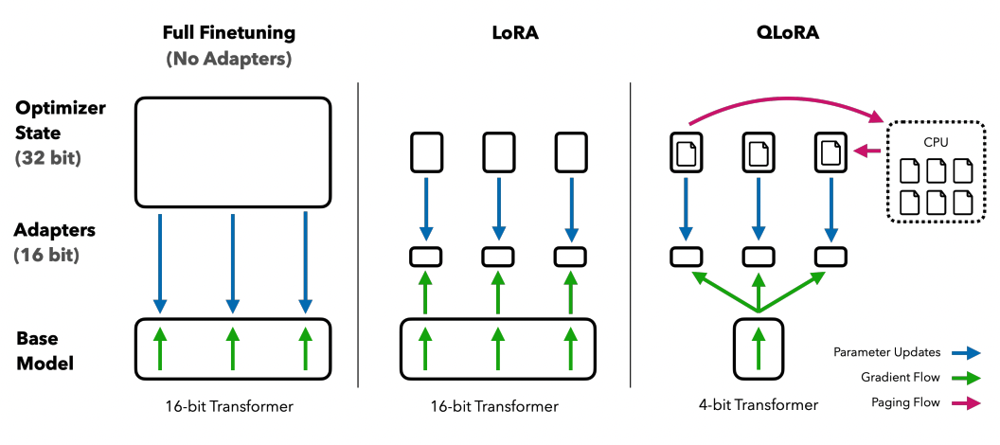
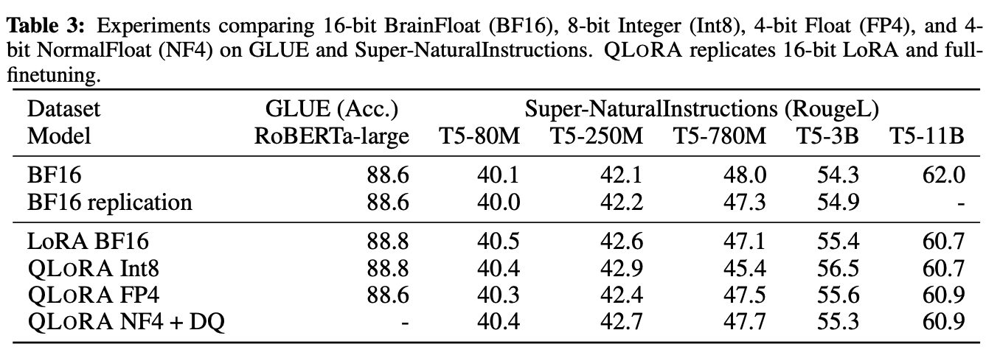

# [엔지니어의 논문 리뷰] QLORA: Efficient Finetuning of Quantized LLMs
    * 논문 주소: https://arxiv.org/abs/2305.14314
## 요약
* QLoRA = LoRA 방식 + 양자화
    * 4비트 양자화된 사전 훈련된 언어 모델을 통해 그래디언트를 역전파를 이용하여 LoRA 로 전달하여 가중치 갱신
* LoRA 란?
    * 간단히 기존 모델의 파라미터는 고정시키고 각 계층에 저랭크 분해 행렬(Low-Rank)을 삽입해 훈련 가능한 매개변수의 수를 줄여 매개변수의 효율성을 가져오는 기법
    * LoRA 정리
        * https://wotres.tistory.com/entry/%EC%97%94%EC%A7%80%EB%8B%88%EC%96%B4%EC%9D%98-%EB%85%BC%EB%AC%B8-%EB%A6%AC%EB%B7%B0-LoRA-Low-Rank-Adaptation-of-Large-Language-Models-%EB%85%BC%EB%AC%B8-%EB%A6%AC%EB%B7%B0
* 양자화란? 모델의 가중치와 활성화함수의 출력을 더 적은 비트로 표현하는것이 양자화(Quantization) (ex 32FP 부동소수점 => 8bit 정수)
    * 이를 통해 정밀도를 낮추되 저장 및 연산에 필요한 메모리를 효율화
* QLoRA 는 4비트 양자화된 언어 모델을 사용하여 GPU 메모리 사용량을 크게 줄이면서도 16비트 finetuning 된 모델의 성능을 유지
* 65B 파라미터 모델을 단일 48GB GPU에서 효율적으로 fine tuning 할 수 있도록 하는 접근 방식 
* 메모리를 절약하면서도 성능을 발휘하여 의미가 있음

## 리뷰
* 대규모 언어 모델(Large Language Models, LLMs)의 Finetuning 은 비용이 많이 발생
* 다른 양자화 기법(LLM 메모리 사용량을 줄이기 위한 기법)도 많지만 추론 시에만 작동하여 메모리가 많이 발생하는 학습에서는 효과가 없다는 문제가 있었음
* QLoRA 는 4비트 양자화된 모델을 성능 저하 없이 Finetuning 하는 것이 가능함을 보여줌
    * 사전 훈련된 모델을 4비트로 양자화한 뒤에 LoRA(Low-rank Adapter) 가중치를 추가
* LLaMA 65B 파라미터 모델의 일반적인 16비트 Finetuning 은 780GB 이상의 GPU 메모리가 필요할 정도로 비용이 많이 발생 => 장비가 너무 많이 필요하다는 문제점이 있었음
    * QLoRA는 65B 파라미터 모델의 Finetuning 시 평균 메모리 요구량을 780GB 이상에서 48GB 미만으로 줄임 => 부족한 장비 자원에서 효율적
    * 메모리 요구량을 줄임과 더불어 16비트로 완전히 Finetuning된 모델에 비교하여 실행 시간이나 예측 성능을 저하시키지 않았음!
    * 즉, QLoRA 를 활용하면 모델들이 단일 GPU에서 미세 조정이 가능해짐
* QLoRA를 사용하여 consumer GPU에서 12시간 이내에 Guanaco 모델을 train 한 결과 Vicuna 벤치마크에서 ChatGPT의 성능 수준의 97.8%에 도달
* QLoRA를 사용하여 professional GPU에서 24시간 Guanaco 모델을 train 한 결과 Vicuna 벤치마크에서 ChatGPT의 성능 수준의 99.3% 달성
* 배포 시, Guanaco 모델 7B는 단지 5GB의 메모리가 필요함
    * 26 GB Alpaca 모델보다 Vicuna 벤치마크에서 20 퍼센트 포인트 이상 성능이 높음 
* 모델의 성능을 희생하지 않으면서 메모리 사용을 줄이기 위한 혁신 기법
    * 4-bit NormalFloat
        * 정규 분포 데이터에서 이론적으로 최적화 된 양자화 데이터 타입
        * 4비트 정수나 4비트 부동소수점보다 더 나은 경험적 결과를 제공
    * Double Quantization
        * 양자화 상수를 양자화
        * 파라미터당 평균 약 0.37비트를 절약
        * 65B 모델에서 3GB 메모리 절감
    * Paged Optimizers
        * 긴 시퀀스 길이를 가진 미니 배치를 처리할 때 발생하는 그래디언트 체크포인팅 메모리 스파이크를 방지하기 위해 NVIDIA 통합 메모리를 사용
* train 시 발견되는 trend
    * 데이터 품질이 데이터셋 크기보다 훨씬 더 중요
        * 9천 샘플 데이터셋(OASST1)이 45만 샘플 데이터셋(FLAN v2, 샘플링된 것)보다 챗봇 성능에서 더 우수
    * 특정 작업에 대해 데이터셋의 적합성이 크기보다 더 중요 
        * MMLU 벤치마크에서의 강력한 성능이 Vicuna 챗봇 벤치마크에서의 강력한 성능을 의미하지 않음
* 
    * QLoRA는 트랜스포머 모델을 4비트 정밀도로 양자화
    * QLoRA는 메모리 스파이크를 처리하기 위해 페이징 옵티마이저를 사용
* 양자화는 입력 데이터를 보다 많은 정보를 담고 있는 표현 방식에서 더 적은 정보를 담는 표현 방식으로 변환하는 과정을 의미
    * ex) 32비트 부동소수점을 8비트 정수로 변환
    * 낮은 비트 데이터 타입을 사용하기 위해 최대값에 의한 정규화
        * ex) 32비트 부동소수점(FP32) 텐서를 범위 [−127, 127]의 Int8 텐서로 양자화
        * 이 때 이상치(입력텐서에 큰값)발생시 양자화 bin(bit 조합) 이 잘작동안할 수 있어 이상치 방지를 위해 입력 텐서를 블록으로 나누어 독립적으로 각각 양자화 (각 블록에 양자와 상수 c 부여)  
        => 입력텐서 X ∈ R^b×h 를 블록 n 개로 나눠 각 블록 크기가 B 가 되게 입력텐서 평탄화 후 (n = (b*h)/B) 각 블록마다 양자화 (양자화 상수 ci 생성) 

* QLoRA 에서 사용된 핵심 기술
    * 4-bit NormalFloat(NF4) 양자화와 더블 양자화(Double Quantization) 에서 단일 기계에서의 미세 조정을 어렵게 만드는 그래디언트 체크포인팅 중 메모리 스파이크를 방지하기 위해 페이징 옵티마이저(Paged Optimizers)를 도입
    * 즉, 3가지 기법 사용: (4-bit NormalFloat Quantization , Double Quantization, Paged Optimizers)
    * 4-bit NormalFloat Quantization
        * 간단히, 사전 학습모델의 가중치가 4 bit 로 양자화 되며 이 데이터는 NormalFloat 즉, [-1, 1]로 정규화 하여 정보의 분포를 유지하면서 계산 비용을 줄임
        * QLoRA는 낮은 정밀도의 저장 데이터 타입(보통 4비트)과 계산 데이터 타입(보통 BFloat16)을 가짐
        * 양자화 오차가 발생할 수 있는데 이 오차는 이상치에 의해 크게 발생하지만 이런 이상치들이 종종 중요한 값들임
        * 각 양자화 빈(bin)에 입력 텐서에서 동일한 수의 값들이 할당되도록 하는 정보 이론적으로 최적화된 Quantile 양자화 방법을 기반
        * 입력 텐서의 분포를 추정하여 양자화하여 입력 데이터의 중요한 특징들은 보존되면서도 데이터 크기를 줄임
        * 4비트 NormalFloat 양자화는 표준 편차 σ를 가진 평균 0의 정규 분포 데이터에 최적화되어 데이터는 [−1, 1] 범위로 정규화
        * 입력 텐서가 특정 양자화 상수에 따라 고정된 분포를 가질 때, 정확한 양자화 추정이 가능해지기 때문에 4-bit NormalFloat Quantization 을 통해 더 정확한 양자화 결과를 제공
        * 즉, 데이터를 효율적으로 압축하여 신경망 모델의 메모리 사용량을 줄이는 동시에, 데이터의 중요한 특성을 최대한 보존
    * Double Quantization
        * 데이터 양자화 과정을 두 단계로 수행하여 추가적인 메모리 절감을 달성하는 기술 (추가적인 메모리 절약을 위해 양자화 상수를 양자화)
        * 첫번째 양자화 때 정밀한 4비트 양자화를 위해 작은 블록크기가 필요하지만 이 역시 메모리 오버헤드 발생 (양자화 상수 메모리 발생)
            * ex) W에 대해 32비트 상수와 64 블록 크기를 사용 시 양자화 상수는 파라미터 당 32/64 = 0.5비트를 추가
        * 두번째 양자화 는 첫 번째 양자화의 양자화 상수(데이터를 양자화하는 데 사용되는 값) 를 두 번째 양자화의 입력으로 취급한 뒤 8비트 부동소수점을 사용하여 두 번째 양자화에 대해 256 블록 크기를 사용
            * ex) W에 대해 32비트 상수와 64 블록 크기를 사용 시 메모리 사용량을 32/64 = 0.5비트이던 첫번째 양자화를   
            8/64 + 32/(64 * 256) = 0.127비트로 줄여, 파라미터 당 0.373비트를 절감
        * 즉, 신경망 모델의 파라미터와 양자화 상수를 두 단계에 걸쳐 양자화함으로써 메모리 사용량을 줄임
            * 4bit 로 pretrained 된 값과 16 bit 실수의 LoRA 연산을 위해 quantization 과 dequantization 을 반복하면서 필요한 양자화 상수를 계산 절약을 위해 k-bit block-wise 즉, 여러개의 블록을 묶어 계산하여 양자화 상수의 개수를 줄이고 이값을 묶은 블록중 절대값 max 를 양자화 상수로 저장하여 효율화
            * 그리고 양자화 상수를 FP32 를 FP8 로 양자화(2차) 하였기 때문에 조금더 정보 (정밀도)를 보존 
    * Paged Optimizers
        * NVIDIA의 통합 메모리 기능을 사용하는 최적화 기술
        * GPU 부족시 CPU와 GPU 간에 자동 페이지 간 전송을 수행
            * 이때 최적화 상태를 위한 페이징 메모리를 할당
            * GPU가 메모리 부족 상태에 있을 때 자동으로 CPU RAM 으로 보낸뒤 최적화 업데이트 단계에서 메모리가 필요할 때 다시 GPU 메모리로 페이징
        * 즉, GPU 메모리 부족을 효과적으로 관리 (OOM(Out of Memory) 에러 방지)
* QLoRA를 16비트 어댑터 미세 조정 및 전체 미세 조정과 비교
    * 기본 LoRA 하이퍼파라미터가 16비트 미세 조정 성능에 미치지 못함
        * 전체적으로 사용된 LoRA 어댑터의 수가 중요
        * 전체 트랜스포머 블록 층에 LoRA를 적용해야만 전체 미세 조정 성능에 부합
* 페이징 옵티마이저(Paged Optimizers)의 중요성
    * 긴 시퀀스 길이를 가진 미니 배치를 처리할 때만 페이징이 발생 하지만 33B/65B 크기의 QLoRA 미세 조정을 단일 24/48GB GPU에서 수행하는 데 필수적
* 4 bit NormalFloat(NF4) 데이터 타입이 4비트 부동소수점(FP4)에 비해 더 나은 성능을 제공
* NF4가 FP4와 Int4에 비해 성능을 상당히 개선하며, 더블 양자화가 메모리 사용량을 줄이면서도 성능을 저하시키지 않는 것을 확인
* 16비트, 8비트, 4비트 어댑터 방법이 완전히 미세 조정된 16비트 기준 모델의 성능을 재현
    * 정밀하지 않은 양자화로 인해 손실된 성능이 양자화 후 어댑터 미세 조정을 통해 완전히 회복될 수 있음을 시사
    * 즉, NF4가 FP4보다 더 효과적이며, 더블 양자화가 성능을 저하시키지 않는다는 것
    * 
* 한계로는  33B 및 65B 규모에서의 전체 16비트 미세 조정 성능과 일치하는지는 확립은 자원비용때문에 확인하지못함
* 논문대로라면 부족한 자원에서는 QLoRA 로 학습을 시도해봐도 될듯 

# 관련 코드
* 